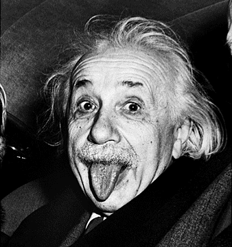
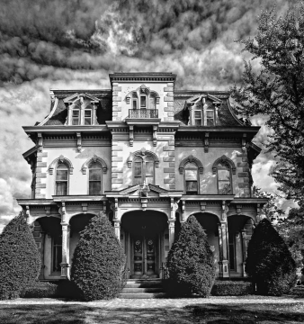
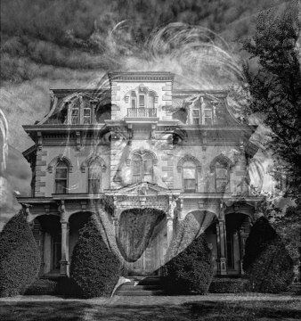
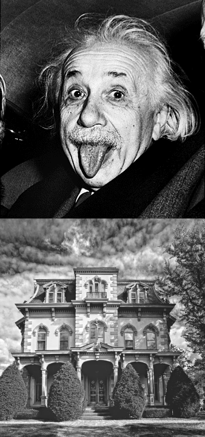
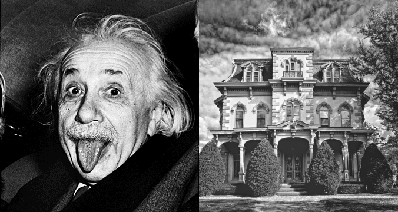
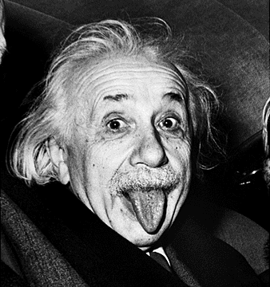
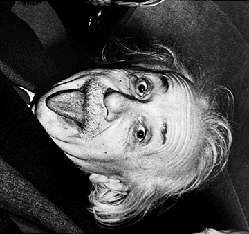
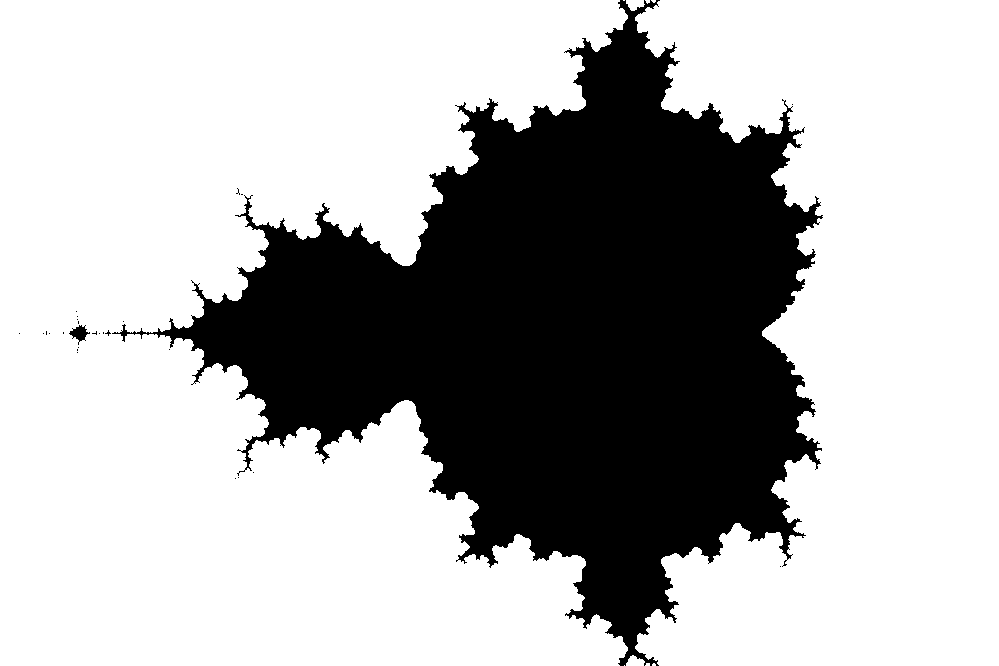
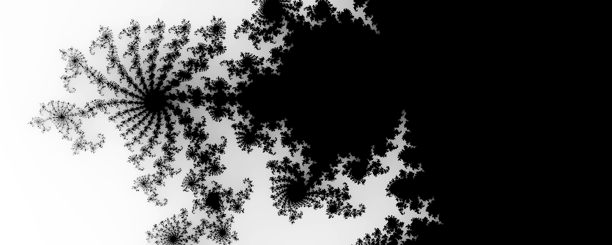

# Лабораторная работа №2. Циклы, массивы

**Внимание**: Запрещено использование функций/методов стандартной библиотеки (`pow`, `count`, `reverse`, ...)!

Во всех задачах целые числа помещаются в тип `int`.

## Задание 1. Циклы for, while

### 1.1 Сумма цифр
Вводится натуральное число `n`. Посчитайте сумму его цифр.

*Input*:
```
42187
```
*Output:*
```
22
```

### 1.2 Наибольший общий делитель

Вводится два числа. Найдите их НОД с помощью алгоритма Евклида.

*Input*:
```
8 12
```
*Output:*
```
4
```

### 1.3 Количество различных элементов

Вводится массив из  целых чисел. Причём гарантируется, что . Найдите количество различных чисел в этом массиве.

*Input*:
```
6
1 1 2 2 2 100
```
*Output:*
```
3
```

### 1.4 Переворот массива

Дан массив целых чисел. Расположите его элементы в обратном порядке.\
Запрещается создавать дополнительные массивы или вводить/выводить элементы не по порядку.

*Input*:
```
6
1 3 5 7 9 11
```
*Output:*
```
11 9 7 5 3 1
```

### 1.5 Перемножение матриц

Даны две целочисленные матрицы. Найдите их [произведение](https://ru.wikipedia.org/wiki/Умножение_матриц).

*Input*:
```
2 4
1 2 3 4
5 6 7 8
4 3
1 2 3
4 5 6
7 8 9
10 11 12
```
*Output:*
```
2 3
70 80 90
158 184 210
```

## Задание 2. Работа с картинками

Любое чёрно-белое изображение может быть представлено как двумерная матрица чисел от 0 до 255 (~~50~~ 256 оттенков серого), где 0 обозначает чёрный цвет, а 255 — белый.

Для начала, чтобы познакомиться со вспомогательными функциями, загрузим из файла две картинки одинакового размера, сохраним в файл и посмотрим на них, чтобы убедиться в корректности чтения/записи.

Сперва подключим библиотеку:
```c++
#include "lab_helpers.h"
```
и добавим следующий код в `int main()`:
```c++
const std::vector<std::vector<int>> im1 = LoadGrayscaleImage("einstein.jpg");
const std::vector<std::vector<int>> im2 = LoadGrayscaleImage("house.jpg");

assert(im1.size() == im2.size()); // Heights of images should match
assert(im1.front().size() == im2.front().size()) // Widths of images should match
const int n = im1.size();
const int m = im1.front().size();
std::cout << "Height: " << n << "\nWidth: " << m << "\n";
WriteGrayscaleImage(im1, "einstein_copy.jpg");
WriteGrayscaleImage(im2, "house_copy.jpg");
```

Проверьте, что исходные изображения `einstein.jpg` и `house.jpg` лежат в папке `cmake-build-debug` вашего CLion-проекта.

Запустите программу. Убедитесь, что рядом с исходными картинками появились их копии. Откройте их и визуально убедитесь, что получившаяся картинка соответствует исходной.





### 2.1 Смешивание

> В этом и всех последующих заданиях вместе с кодом приложите к решению получившиеся картинки, назвав их по шаблону `<task>_<subtask>_any_title_you_wish.jpg`
> Например, `2_1_blended.jpg`, `2_2_horizontal.jpg`

> В этом и всех последующих заданиях вы можете использовать любые две собственные картинки в формате .jpg, при условии что они одинакового размера.
>
> Совет: Не берите картинки в сверх-высоком разрешении с общим кол-вом пикселей больше одного миллиарда.

Создайте новую матрицу, в которой цвет каждого пикселя получен смешиванием цветов соответствующих пикселей первого и второго изображения с коэффициентом . При  результат должен совпадать с первым изображением, а при  — со вторым.

Для  результат должен выглядеть так:



### 2.2 Конкатенация

Создайте новую матрицу, полученную вертикальной конкатенацией двух предыдущих, то есть "дописыванием" набора строк второй матрицы к набору строк первой.
    


Создайте новую матрицу, полученную горизонтальной конкатенацией двух предыдущих, то есть "дописыванием" строк второй матрицы к соответствующим строкам первой.
    


### 2.3 Отражение

Создайте новую матрицу, полученную горизонтальным отражением первой.



### \*2.4 Поворот

Создайте новую матрицу, полученную поворотом первой на 90 градусов направо.\
_Подсказка_: разложите операцию поворота на две более простые операции.
    


## Задание 3. Генерация фрактала

В этом задании вам предстоит сгенерировать фрагмент [Множества Мандельброта](https://ru.wikipedia.org/wiki/Множество_Мандельброта).

Для любой точки вещественной плоскости  её принадлежность множеству определяется следующим образом.
- Возьмём два числа:  и 
- На каждой итерации будем преобразовывать их по правилу:\
  \
  \
  (откуда берутся такие формулы, вы поймёте, когда пройдёте комплексные числа).
- Если полученная последовательность ограничена (то есть существует такое , что ), то точка  принадлежит множеству, а иначе не принадлежит.

Так как проверить ограниченность последовательности в общем виде — нетривиальная задача, мы ограничимся приближённым вычислением. Можно показать, что как только расстояние от  до  станет больше , последующие расстояния будут возрастать. Поэтому можно проделывать некоторое заранее заданное количество итераций (например, ), и если точка  всё ещё осталась в круге радиуса , то считать, что  принадлежит множеству.

Вам нужно выбрать прямоугольник на плоскости и сгенерировать описанный фрактал. Пусть чёрным цветом обозначается принадлежность точки множеству, а белым — не принадлежность.
    


### \*Градиент

Можете также исследовать, как генерируются градиентные изображения этого множества. На самом деле нужно всего лишь использовать количество произведённых итераций до выхода из круга для определения цвета пикселя.
    
